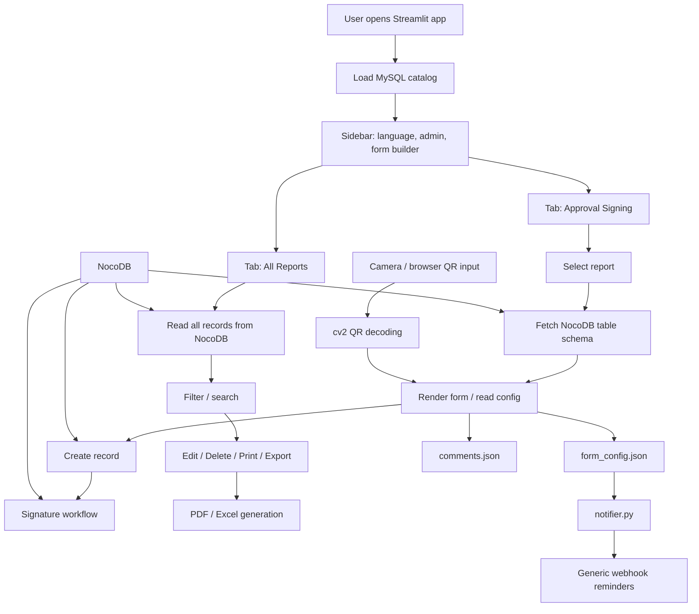

# E-Report Project Knowledge Base
- WEB APP DEMO : https://are-leave-tony-buzz.trycloudflare.com/
## Log-in to use ADMIN ROLE FRIST!!
- PASSWORD : admin1234
## 1. Overview

This project is a Streamlit-based electronic report management system for creating, approving, editing, exporting, and printing operational records via NocoDB-backed tables.

The system is designed to handle:

- report catalog listing from MySQL
- dynamic form generation from NocoDB schema
- field-level form configuration stored in JSON
- approval/signature workflow
- QR auto-fill from camera
- notification reminders via generic webhook
- PDF export of signed records

The main application is implemented in `app.py`, with background notification logic in `notifier.py`.

---

## 2. Tech Stack

### Core

- Python 3
- Streamlit — main UI framework
- Pandas — data processing and table handling
- Requests — NocoDB and webhook communication
- PyMySQL — MySQL connectivity
- reportlab — PDF generation
- Pillow, OpenCV (cv2) — QR image decoding and image processing
- openpyxl — Excel export

### UI / Extensions

- streamlit-drawable-canvas — signature canvas
- st-mui — time picker widget

### External systems

- NocoDB — dynamic table schema and record storage
- MySQL — report catalog / metadata source
- Generic Webhook — reminder and success notifications

---

## 3. Repository Structure

```text
E-Report/
├── app.py                        # Main Streamlit application
├── notifier.py                  # Background reminder daemon
├── requirements.txt             # Python dependencies
├── form_config.json             # Dynamic form config per table
├── comments.json                # Form instructions/comments per table
├── notify_state.json            # Notification reminder state
└── .streamlit/                  # Streamlit settings and secrets
```

---

## 4. Runtime Architecture



---

## 5. Main Application Logic

### 5.1 App startup

`app.py` starts by:

- setting page config with `st.set_page_config(...)`
- showing toast message from session state
- injecting a custom CSS theme
- loading secrets from `.streamlit/secrets.toml`
- reading NocoDB base URL and token
- initializing the language dictionary
- loading report metadata from MySQL via `load_data()`

### 5.2 Data source: report catalog

The function `load_data()` ensures and reads the `ereport_catalog` table in the configured MySQL database (`database_1`) and returns a DataFrame containing:

- department
- report name
- source link
- table link
- table ID
- updated date

This catalog becomes the main navigation list for the application.

### 5.3 Form Builder

Admins can use `สร้างแบบฟอร์มใหม่` to create a NocoDB table and its fields from
the application. The builder then registers the new table in the report catalog
and creates the initial `form_config.json` entry. Admins can delete a form from
the Reports tab; deletion requires confirmation and removes both the NocoDB table
and the `ereport_catalog` entry. Add the NocoDB Base ID to
`.streamlit/secrets.toml` before using it:

```toml
[nocodb]
base_id = "pxxxxxxxxxxxxxxxx"
```

`project_id` is also accepted as an alias. The token must have metadata write
permission in addition to the existing record read/write permission.

### 5.4 NocoDB integration

The app interacts with NocoDB through APIs:

- `noco_get_fields(table_id)` — fetch schema/field metadata
- `noco_get_records(table_id, ...)` — fetch records
- `noco_get_all_records(table_id)` — pagination-based full read
- `noco_create_record(table_id, fields)` — create a new record
- `noco_update_record(table_id, record_id, fields)` — update existing record
- `noco_delete_record(table_id, record_id)` — delete record
- `noco_upload_attachment(file)` — upload image/files to NocoDB storage
- `noco_upload_signature(table_id, record_id, field_name, signature_base64)` — attach a signature image to a record

This is the system's primary persistence layer for form data.

---

## 6. Major User Workflows

### 6.1 Report catalog / approval page

On app load, the system:

1. loads the report catalog from MySQL
2. filters by department or search text
3. renders a list of available reports in the approval tab
4. allows opening a selected report form or record list

This is the entry point for operational users.

### 6.2 Form creation workflow

When a user chooses a report:

1. the app fetches the table schema from NocoDB
2. it merges admin configuration from `form_config.json`
3. it decides which fields are visible, required, ordered, or hidden
4. it auto-detects date/time field types based on field names
5. it renders widgets dynamically based on NocoDB field type
6. if configured, it supports:
   - QR auto-fill via camera
   - date auto-fill logic
   - range validation
   - attachment upload

Then the save flow does:

1. collect values from widgets
2. validate required fields
3. validate numeric ranges when configured
4. upload attachment files to NocoDB
5. create the record via `noco_create_record()`
6. rerender the page and show success toast

### 6.3 Signature workflow

The signature process is handled in `sign_dialog()`.

Critical steps:

1. selected record is loaded
2. all signature fields are identified by names beginning with `signature`
3. existing signatures are displayed if present
4. unsigned signature fields render `st_canvas()` widgets
5. user signs via browser canvas
6. PNG image is generated from canvas data
7. image is uploaded using `noco_upload_signature()`
8. record is patched with the attachment payload
9. success/failure state is stored in session and rerun occurs

This allows multi-signature approval for one record.

### 6.4 Record edit workflow

The edit dialog reuses the same schema and configuration logic as form creation, but pre-fills values from the existing record.

It supports:

- editing text, number, date, select, and checkbox fields
- uploading additional attachments
- removing old attachments
- QR auto-fill update in editable fields
- updating only changed fields

The app builds a `changes` dictionary and calls `noco_update_record()`.

### 6.5 Print workflow

`print_dialog()` builds a PDF from the selected record.

The generated PDF includes:

- record field details excluding attachment/signature entries
- signature sections as rendered images
- CJK-capable fonts (if available on Windows system fonts)

This is used for print-ready approval records.

### 6.6 Export workflow

`build_excel_with_images(records, ...)` exports record data to Excel in memory.

Behavior:

- collects all fields across all records
- resolves attachment fields to downloadable images
- inserts actual images into Excel cells when possible
- falls back to text for unsupported or failed downloads
- returns binary `.xlsx` data for browser download

---

## 7. Form Configuration Model

### `form_config.json`

This JSON file controls per-table form behavior. It is the most important admin customization file.

Typical structure:

- table ID as key
- `fields`: array of field configs
- `date_autofill`: primary and secondary date behavior
- field-level `date_format`: output format preference for date fields
- `qr_autofill`: QR field mapping and delimiter
- `notify`: generic webhook reminder settings
- `allow_edit_after_submit`: user-edit permission flag

Examples of config logic:

- mark certain fields as visible/hidden
- mark required fields
- set field order
- set input placeholder
- set date format
- define supplemental date auto-fill
- bind QR field names to segment positions

This file acts as the admin schema layer that overrides raw NocoDB structure.

### `comments.json`

This file stores per-table user-facing guidance/instructions.

The app loads and displays them when a user fills a form, helping with operational guidance such as:

- step-by-step instructions
- business rules
- required format examples
- notes on how to complete the form

---

## 8. QR Auto-Fill Logic

The QR flow is implemented in `decode_qr_from_image()` and `qr_webrtc_scanner()`.

### Behavior

- On the UI, a QR-enabled field shows a camera button
- the user clicks the button and scans a QR code using the browser camera
- the image is decoded on the server side using OpenCV `QRCodeDetector`
- the result is stored in session state
- the app splits the QR payload by configured delimiter
- it fills one field with one segment according to the mapping

Example:

- QR payload: `ABC|12345|X`
- delimiter: `|`
- field mapping: segment = `2`
- field value becomes `12345`

This is useful when QR codes carry machine-readable multiple segments, such as part number + lot + item code.

---

## 10. Notification Daemon (`notifier.py`)

`notifier.py` is a separate background process that watches form configs for reminder rules.

### Purpose

It ensures that if a report has not received a new record by a configured time, a webhook reminder is sent repeatedly until data arrives.

### Logic

For each configured table:

1. read `form_config.json`
2. inspect `notify` section
3. determine start time and reminder interval
4. query the latest record of that table
5. compare `CreatedAt` against the current reminder cycle
6. if no new record appears:
   - send reminder message by generic webhook
   - repeat by interval until the record arrives
7. if a record is found today:
   - stop reminders
   - optionally send a success notification

State is saved to `notify_state.json` to avoid duplicate notification storms after restart.

The notification sender posts JSON to the configured webhook URL:

```json
{
   "message": "notification text",
   "text": "notification text"
}
```

### 10.1 Current connection settings

The active deployment uses local services configured in `.streamlit/secrets.toml`:

- MySQL: `localhost:5000`, database `database_1`
- NocoDB: `http://localhost:8890`
- NocoDB Base ID: required for creating tables from Builder

The app creates `ereport_catalog` automatically in MySQL. It is the report
index used by both the Form Builder and the Reports tab.

---

## 11. Key Files and Their Roles

### `app.py`

Main application and UI logic.

Responsibilities:

- Streamlit interface
- report listing
- form rendering
- schema-driven UI generation
- record CRUD actions
- signature logic
- PDF export
- QR integration
- Excel generation
- admin configuration UI

### `notifier.py`

Background operational reminder service.

Responsibilities:

- scheduled monitoring of blank report submissions
- Generic webhook reminder sending
- status persistence via JSON

### `form_config.json`

Admin-managed dynamic config for each table.

### `comments.json`

Instruction text displayed to users for each form.

### `notify_state.json`

Persisted state for reminder logic.

### `requirements.txt`

Dependency manifest for the application.

---

## 12. Important Design Decisions

### 12.1 Schema-driven UI

The application does not hardcode each form. Instead, it loads field metadata from NocoDB and renders widgets based on type and configuration. This makes the system flexible and reusable across many report tables.

### 12.2 Config as runtime override

`form_config.json` overrides the raw NocoDB schema. This is critical because the app can adapt field visibility, requiredness, ordering, and validation without changing the underlying table structure.

### 12.3 NocoDB as the operational data layer

NocoDB is used instead of directly writing all logic into MySQL because it provides a flexible schema and API-based CRUD layer, while the app remains in Python.

### 12.4 Browser-camera QR input

QR scanning is done via browser camera and then decoded server-side. This avoids needing to open low-level local camera access on the backend server directly.

### 12.5 Background reminder daemon

The reminder system is intentionally separate from `app.py`, because it needs to run continuously without the Streamlit app being open.

---

## 13. Operational Risks / Caveats

- NocoDB API responses and field naming must be checked carefully; some metadata keys may differ by schema.
- QR values depend on delimiter and segment mapping being configured correctly.
- PDF generation depends on system fonts for CJK support.
- Attachment and signature URLs may expire or change depending on NocoDB storage behavior.
- Notification logic depends on valid webhook settings and proper secret formatting.

---

## 14. Recommended AI Knowledge Notes

When working with this project in AI-agent context, keep these points in mind:

1. Main app entry: `app.py`
2. Background reminder service: `notifier.py`
3. Form behavior is controlled by `form_config.json`
4. User instructions are stored in `comments.json`
5. NocoDB is the working database for records and form schema
6. MySQL is catalog metadata and report index
7. QR fill depends on delimiter/segment mapping
8. Signature fields are named with a `signature` prefix and use the canvas dialog
9. Attachments and signatures are uploaded through the NocoDB API
10. UI is dynamic, not static, and should be extended using the same pattern

---

## 15. Suggested Next Enhancements

- Add a unified schema/versioning layer for form configs
- Add tests around config validation and QR parsing
- Centralize API error handling and logging
- Add health checks for NocoDB and webhook dependencies
- Add deployment docs for `.streamlit/secrets.toml` structure
- Add README for GitHub with quick start instructions

---

## 16. Short Summary

This project is a dynamic, schema-driven electronic reporting system built on Streamlit, NocoDB, and external operational data sources. It manages report metadata, form entry, record approval/signature, QR-driven data filling, export, print, and automated reminder notifications. The system is highly configurable through `form_config.json`, making it suitable for multi-form operational reporting across departments.

---

## 17. GitHub-Ready Project Description

> E-Report is a Streamlit-based electronic reporting and approval platform for operational departments. It dynamically generates forms from NocoDB schemas, supports QR auto-fill, signature approval, record editing, PDF/Excel export, and automated reminder notifications via generic webhooks. The system uses MySQL for report catalog metadata.
